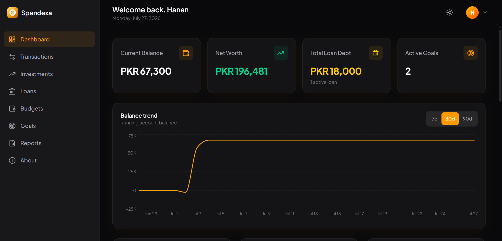
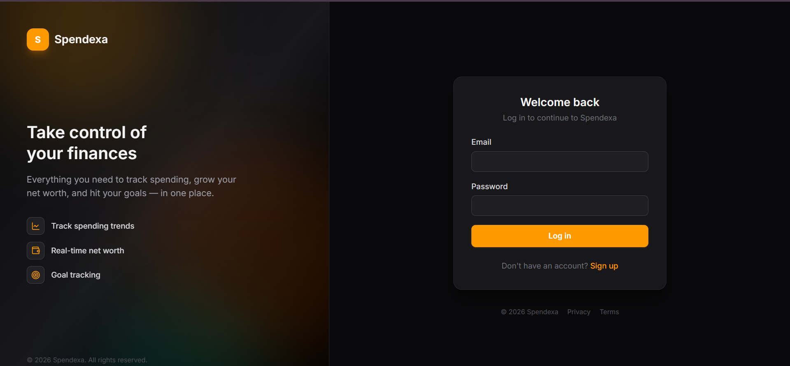
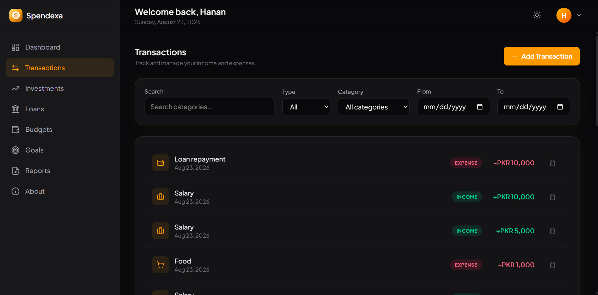
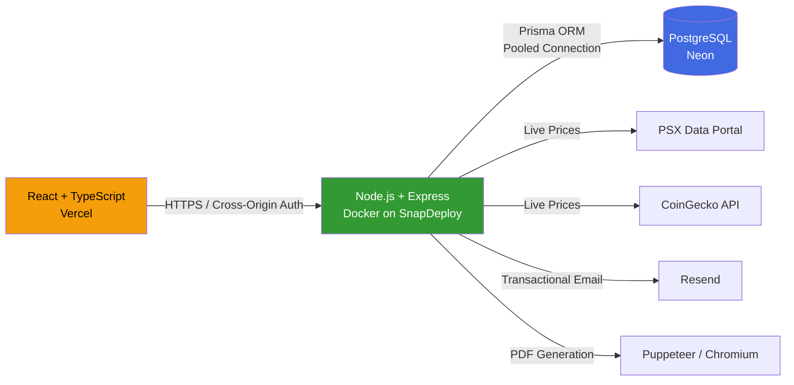

<div align="center">



# Spendexa

### Total financial clarity, in one place.

[](https://git.io/typing-svg)

[](https://spendexa-web.vercel.app)
[](#license)
[](https://spendexa-web.vercel.app)


[**Live Demo**](https://spendexa-web.vercel.app) · [**Report Bug**](../../issues) · [**Request Feature**](../../issues)

</div>

<br/>

## 📖 About The Project

Spendexa is a full-stack personal finance management platform — track transactions, manage budgets, monitor investments (with **live PSX stock and crypto pricing**), track loans, set savings goals, and generate branded PDF/Excel financial reports, all from a single, unified dashboard.

**The origin story:** Spendexa began as a C++ terminal application for a university Data Structures course — a hash table for auth, a binary search tree for account indexing, a singly linked list for budget tracking, and flat-file CSV persistence. This repository is a complete, ground-up rebuild into a modern, production-grade, deployed full-stack web application — same core financial concepts, entirely new architecture.

> 💡 **Why this matters:** every core money calculation in this app — net worth, budget tracking, loan interest, transaction reversals — has been through **two independent full-project audits** with live, evidence-based testing (not just code review). Real bugs were found and fixed, with before/after numbers to prove it. See [Engineering Highlights](#-engineering-highlights) below.

<br/>

## 📸 Screenshots

<table>
<tr>
<td width="50%"></td>
<td width="50%"></td>
</tr>
<tr>
<td align="center"><sub><b>Dashboard</b> — net worth, balance trend, spending breakdown, day-over-day change</sub></td>
<td align="center"><sub><b>Authentication</b> — branded split-screen login with animated background</sub></td>
</tr>
<tr>
<td colspan="2"></td>
</tr>
<tr>
<td colspan="2" align="center"><sub><b>Transactions</b> — filterable ledger with real-time balance updates</sub></td>
</tr>
</table>

<br/>

## ✨ Features

### 💰 Core Finance Tracking
- **Dashboard** — real-time net worth, current balance, total loan debt, active goals, with day-over-day and percentage change indicators
- **Transactions** — income/expense tracking with category filters, date-range search, and paginated history
- **Budgets** — period-based budget tracking with near-limit alerts, correctly reconciled against transactions (no orphaned spend on budget switch/delete)
- **Goals** — savings goals with visual progress tracking and deadlines
- **Loans** — flat-interest loan tracking with full repayment history; taking or repaying a loan correctly flows into account balance and net worth

### 📈 Investments — with Live Market Data
- Track stocks (PSX), crypto, real estate, and precious metals in one portfolio view
- **Smart Pricing**: auto-fills historical purchase price on entry (with weekend/holiday fallback to the last trading day) and lets you refresh current market value on demand — powered by live PSX and CoinGecko data
- Gain/loss tracking with automatic portfolio allocation charts

### 📄 Reports
- Branded, paginated **PDF exports** (Puppeteer-rendered) with your full financial summary
- **Excel exports** with multiple formatted sheets — opens cleanly in Excel, LibreOffice, or Google Sheets
- Both viewable inline or downloadable

### 🔐 Security & Auth
- JWT authentication in `httpOnly` cookies, `bcrypt` password hashing
- Rate limiting on all authentication endpoints
- Full **forgot/reset password** flow via email (Resend)
- Strict per-user data isolation — every route scoped at the database query level (verified via live cross-user penetration testing)

### 🎨 Experience
- Full **dark/light mode** with a considered, non-inverted color system
- Fully responsive — sidebar collapses to a drawer, tables become cards on mobile
- Smooth, deliberate motion (Framer Motion) — staggered card entrances, animated counters, chart transitions
- Graceful **cold-start handling** — a clear "waking up the server" message instead of a silent hang on free-tier infrastructure

<br/>

## 🏗️ Architecture

This app runs on three independently deployed, connected services:



| Layer | Technology | Hosting |
|---|---|---|
| Frontend | React 18, TypeScript, Vite, Tailwind CSS, Framer Motion | [Vercel](https://vercel.com) |
| Backend | Node.js, Express, TypeScript, Zod validation | [SnapDeploy](https://snapdeploy.dev) (Dockerized) |
| Database | PostgreSQL, Prisma ORM (pooled + direct connections) | [Neon](https://neon.tech) |
| Auth | JWT (httpOnly cookies), bcrypt | — |
| Email | Resend (password reset) | — |
| Reports | ExcelJS, Puppeteer (PDF) | — |

<br/>

## 🔧 Engineering Highlights

A few things worth calling out for anyone reviewing this codebase:

- **Two independent full-project audits**, weeks apart, using different tools — every finding either fixed with live before/after proof, or formally re-verified and corrected when a claim turned out to be a false positive.
- **Real money-integrity bug fixes**, each with a reproducible before/after test: a budget corruption bug (transactions weren't linked to a specific budget by ID, causing spend tracking to drift when budgets were switched), and a loan/cash-flow disconnect (taking or repaying a loan wasn't moving account balance, silently distorting net worth).
- **Zero IDOR** — exhaustively tested cross-user data access on every resource type; all correctly return `404`, not leaked data.
- **Production-grade connection handling** — pooled Neon connections with automatic fallback/retry on the dashboard route, verified to hold up under concurrent load testing (5-way concurrent PDF generation, 0 failures).
- **Dockerized backend** with a multi-stage build, correctly handling native module compilation (`bcrypt`) and a musl-compatible Chromium install for Puppeteer on Alpine Linux.
- **Cross-origin auth done right** — `SameSite=None` + `Secure` cookies, strict CORS origin matching, verified live across the deployed Vercel ↔ SnapDeploy boundary.

<br/>

## 🚀 Getting Started

### Prerequisites
- Node.js 18+
- A PostgreSQL database (e.g. a free [Neon](https://neon.tech) instance)

### Installation

```bash
# Clone the repo
git clone https://github.com/Abdul-Hanan-07/Spendexa-Web.git
cd Spendexa-Web

# Install backend dependencies
cd server
npm install

# Set up environment variables
cp .env.example .env
# Fill in DATABASE_URL, DIRECT_URL, JWT_SECRET, RESEND_API_KEY

# Run database migrations
npx prisma migrate dev

# Start the backend
npm run dev
```

```bash
# In a new terminal — install and start the frontend
cd client
npm install
cp .env.example .env
# Set VITE_API_URL to your backend URL

npm run dev
```

The app will be running at `http://localhost:5173`.

### Environment Variables

**Backend (`server/.env`)**

| Variable | Description |
|---|---|
| `DATABASE_URL` | Pooled PostgreSQL connection string |
| `DIRECT_URL` | Direct (non-pooled) PostgreSQL connection string, required for migrations |
| `JWT_SECRET` | Secret key for signing auth tokens |
| `RESEND_API_KEY` | API key for transactional email (password reset) |
| `CLIENT_ORIGIN` | Your frontend's URL, for CORS |
| `NODE_ENV` | `development` or `production` |

**Frontend (`client/.env`)**

| Variable | Description |
|---|---|
| `VITE_API_URL` | Your backend's URL |

<br/>

## 📁 Project Structure

```
Spendexa-Web/
├── client/                 # React + TypeScript frontend
│   ├── src/
│   │   ├── components/     # Reusable UI components
│   │   ├── pages/          # Route-level pages
│   │   ├── hooks/          # Custom React hooks
│   │   └── lib/            # API client, utilities
│   └── public/              # Static assets, logo, favicon
│
├── server/                 # Node.js + Express backend
│   ├── src/
│   │   ├── routes/          # API route handlers
│   │   ├── lib/              # Business logic (pricing, reports)
│   │   ├── schemas/         # Zod validation schemas
│   │   └── middleware/      # Auth, rate limiting
│   ├── prisma/
│   │   └── schema.prisma    # Database schema
│   └── Dockerfile
│
└── README.md
```

<br/>

## 🗺️ Roadmap

- [ ] Automated test suite (unit + integration coverage for money-math routes)
- [ ] Shared types package between client and server
- [ ] Goal editing (currently create/update-progress/delete only)
- [ ] Multi-currency support
- [ ] Recurring transactions

<br/>

## 📄 License

Distributed under the MIT License. See `LICENSE` for more information.

<br/>

## 👤 Author

**Abdul Hanan**

Full-stack developer, BSCS student at University of the Punjab. Open to freelance work and full-stack opportunities.

[](https://github.com/abdul-hanandev)
[](https://www.linkedin.com/in/abdul-hanandev/)

<br/>

<div align="center">

**If this project helped you or you found it interesting, consider giving it a ⭐**

</div>
